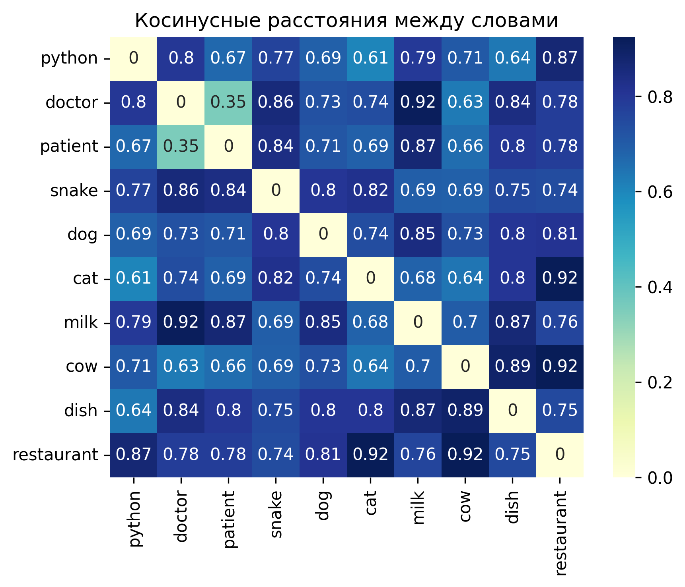

# Лабораторная работа №2

В рамках лабораторной работы реализован конвейер векторизации текстовых документов на основе семантических эмбеддингов.

Основные результаты

* Обучена модель Word2Vec (skip-gram) на корпусе, подготовленном в ЛР №1.
* Реализована векторизация документов через усреднение векторов леммированных слов.
* Проведена демонстрация семантической близости: для слова doctor найдены ближайшие по смыслу термины (physician, surgeon, hospital).
* Выполнены эксперименты с гиперпараметрами (размер вектора, окно контекста, архитектура) — определена оптимальная конфигурация.
* Вся тестовая выборка преобразована в векторное представление и сохранена в формате TSV.

## Эксперименты

```
--- Обучение: small ---
Тестовое слово: doctor
  Наиболее близкие: [('patient', 0.7656024694442749), ('psychiatric', 0.7433297634124756), ('fertility', 0.7284757494926453), ('authority', 0.7272676229476929), ('confidentiality', 0.7270032167434692)]
  Близкие: [('physician', 0.7102533578872681), ('surgeon', 0.587867021560669)]
  Связанные: [('patient', 0.7656025886535645), ('hospital', 0.7163163423538208), ('clinic', 0.6475953459739685)]
  Несвязанные: [('car', 0.4033953547477722), ('computer', 0.3824295401573181), ('ocean', 0.19746966660022736)]

--- Обучение: default ---
Тестовое слово: doctor
  Наиболее близкие: [('patient', 0.7719522714614868), ('leukemia', 0.7319939136505127), ('cardiologist', 0.7180310487747192), ('physician', 0.7168638110160828), ('psychiatric', 0.7123351693153381)]
  Близкие: [('physician', 0.7168638706207275), ('surgeon', 0.43824249505996704)]
  Связанные: [('patient', 0.771952211856842), ('hospital', 0.676584005355835), ('clinic', 0.5569181442260742)]
  Несвязанные: [('car', 0.3152921795845032), ('ocean', 0.21382930874824524), ('computer', 0.20196853578090668)]

--- Обучение: large ---
Тестовое слово: doctor
  Наиболее близкие: [('patient', 0.6487469673156738), ('physician', 0.6270281076431274), ('cardiologist', 0.6185584664344788), ('leukaemia', 0.611290454864502), ('hospital', 0.5911780595779419)]
  Близкие: [('physician', 0.6270281076431274), ('surgeon', 0.3912787139415741)]
  Связанные: [('patient', 0.6487470269203186), ('hospital', 0.5911781787872314), ('clinic', 0.4972367286682129)]
  Несвязанные: [('car', 0.2073538452386856), ('ocean', 0.18870455026626587), ('computer', 0.08020725101232529)]

--- Обучение: cbow ---
Тестовое слово: doctor
  Наиболее близкие: [('patient', 0.7199485898017883), ('procedure', 0.600262463092804), ('disorder', 0.5899183750152588), ('brain', 0.5858780741691589), ('cancer', 0.5746126174926758)]
  Близкие: [('physician', 0.5045878887176514), ('surgeon', 0.4026716947555542)]
  Связанные: [('patient', 0.7199484705924988), ('hospital', 0.5496261119842529), ('clinic', 0.49859490990638733)]
  Несвязанные: [('computer', 0.13883525133132935), ('car', 0.10721445083618164), ('ocean', -0.039950206875801086)]
Эксперименты завершены. Модели сохранены.
```

## Heatmap



## Вывод

Работа демонстрирует, что нейросетевые эмбеддинги (Word2Vec) эффективно кодируют семантические отношения между словами и позволяют получать осмысленные векторные представления документов.