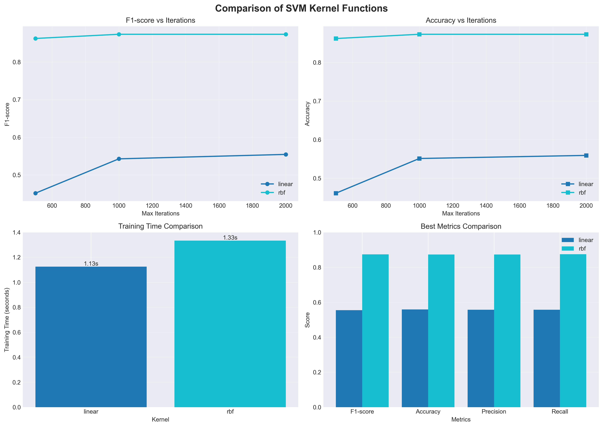
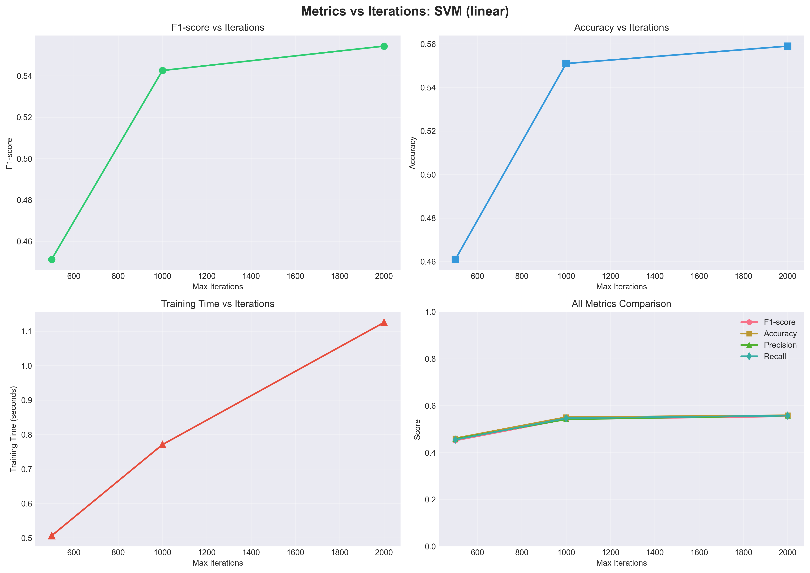
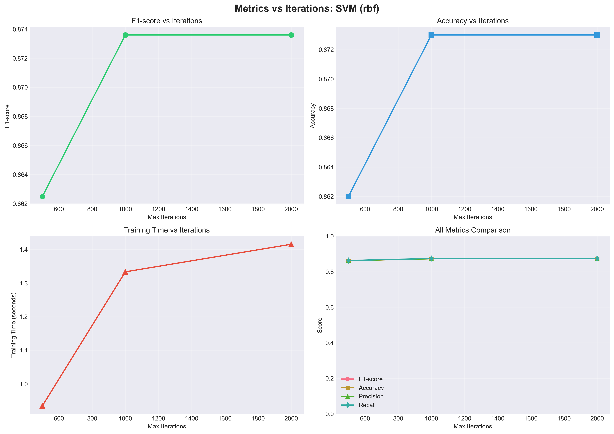
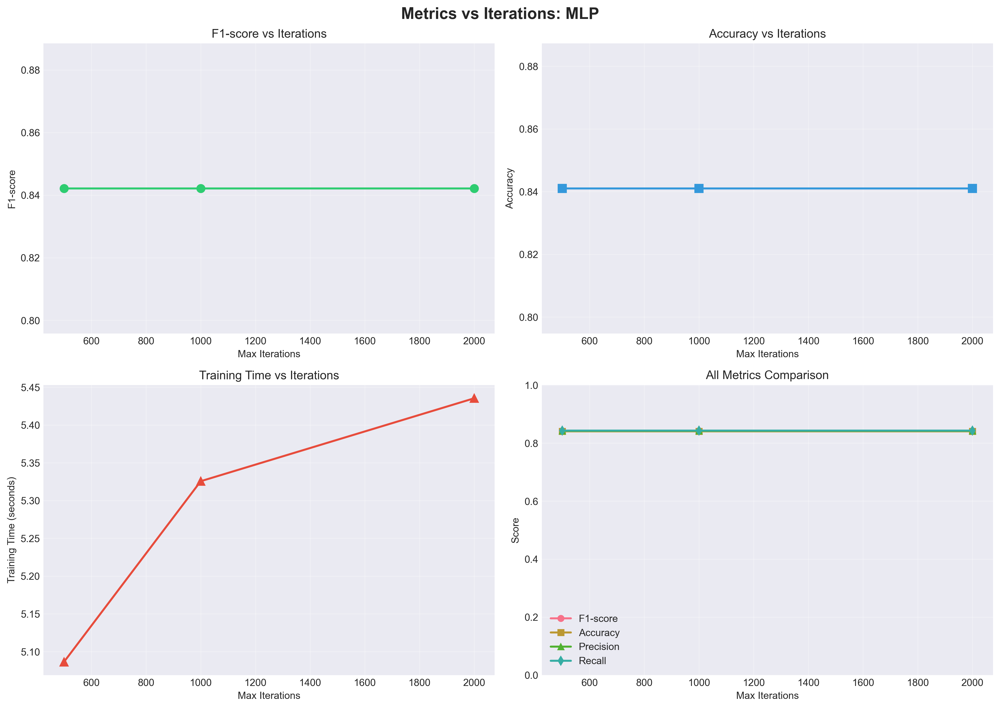
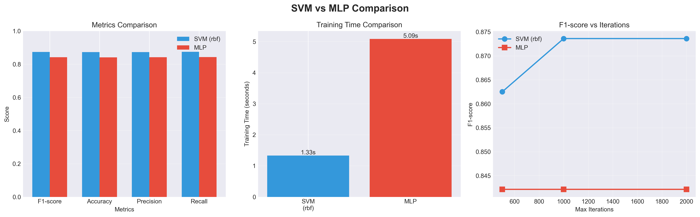
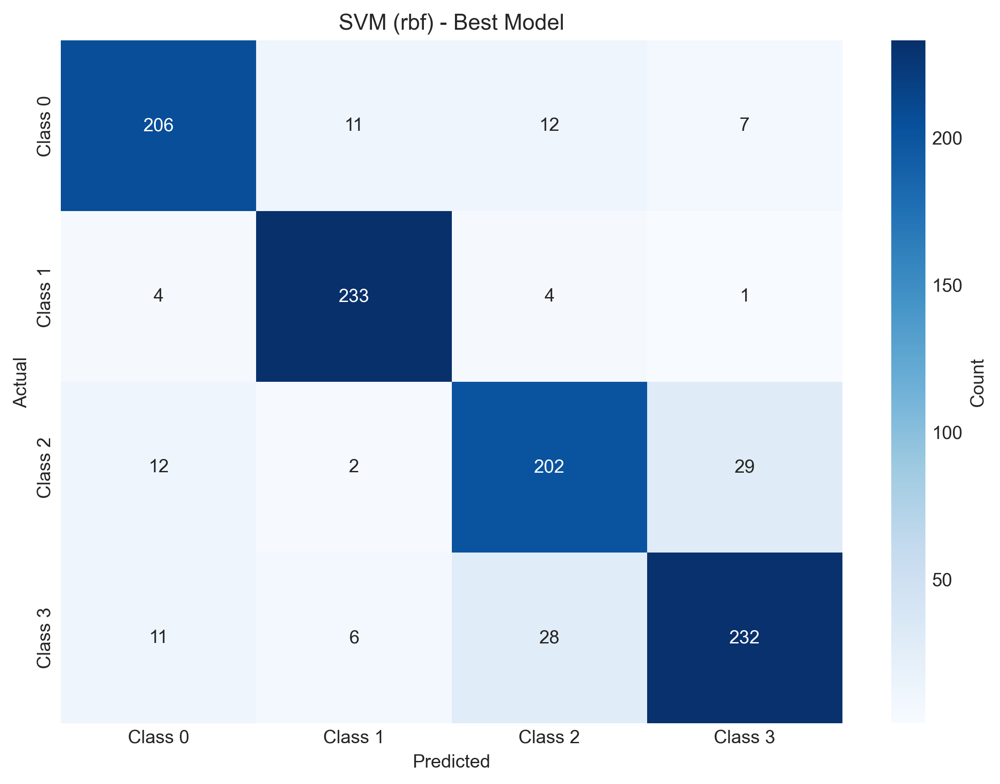
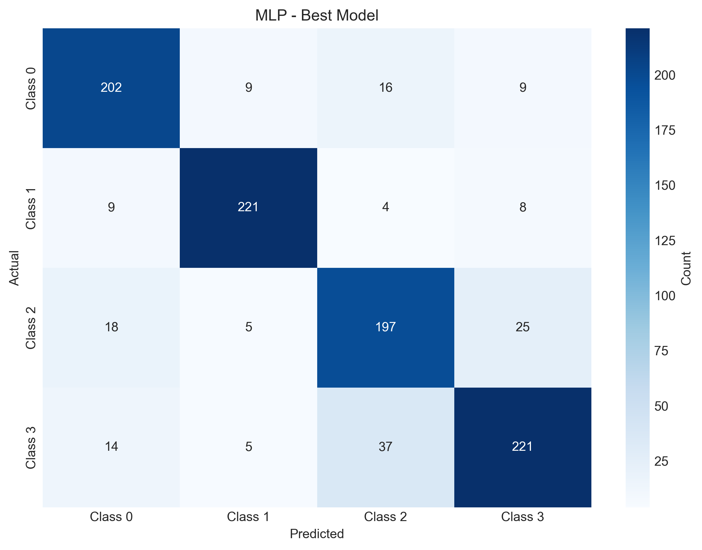
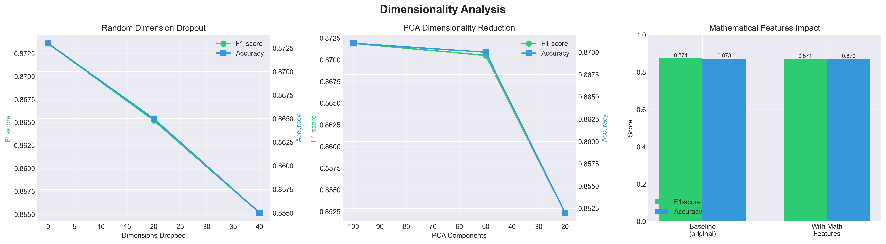

# Лабораторная работа №3.1 (Классификация текстов)

## Описание

В рамках лабораторной работы реализована система многоклассовой классификации текстов с использованием векторных представлений документов, полученных в результате выполнения второй лабораторной работы.

## Основные компоненты

### Структура проекта

```
lab3-1/
├── source/
│   ├── __init__.py
│   ├── main.py                 # Главный модуль для запуска экспериментов
│   ├── data_loader.py          # Загрузка векторных представлений и меток
│   ├── metrics.py              # Ручной расчет метрик классификации
│   ├── experiments.py          # Проведение экспериментов с моделями
│   ├── dimensionality.py       # Эксперименты с размерностью
│   └── vector_generator.py     # Генерация векторных представлений
├── assets/                     # Директория для результатов и данных
│   ├── train_vectors.tsv       # Векторные представления обучающей выборки
│   └── results.json            # Результаты всех экспериментов
├── requirements.txt            # Зависимости проекта
└── README.md                   # Данный файл
```

### Реализованные возможности

1. **Загрузка данных**
   - Загрузка векторных представлений из TSV файлов
   - Загрузка меток классов из CSV файлов
   - Автоматическая генерация векторов при необходимости

2. **Расчет метрик (без использования библиотечных методов)**
   - Precision (точность) для каждого класса и макро-усредненная
   - Recall (полнота) для каждого класса и макро-усредненная
   - F1-score для каждого класса и макро-усредненная
   - Accuracy (точность классификации)
   - Confusion Matrix (матрица ошибок)

3. **Эксперименты с моделями**
   - SVM с различными kernel функциями: linear, rbf, poly, sigmoid
   - MLP (Multi-Layer Perceptron) для сравнения
   - Эксперименты с различным количеством итераций обучения
   - Измерение времени обучения

4. **Эксперименты с размерностью**
   - Отбрасывание случайно выбранных размерностей
   - Сокращение размерности через PCA
   - Добавление математических признаков (log, cos, sin)

## Требования

- Python 3.7+
- Зависимости из `requirements.txt`:
  - numpy
  - pandas
  - scikit-learn
  - gensim
  - nltk
  - matplotlib (для построения графиков)
  - seaborn (для визуализации)

## Установка

```bash
pip install -r requirements.txt
```

## Использование

### Базовое использование

Запуск всех экспериментов:

```bash
cd projects/as-harlamov/lab3-1
python source/main.py --generate_vectors
```

### Параметры командной строки

- `--lab2_path PATH`: Путь к директории lab2 (по умолчанию: `../lab2`)
- `--generate_vectors`: Сгенерировать векторы для train/test датасетов
- `--skip_basic`: Пропустить базовые эксперименты (SVM/MLP сравнение)
- `--skip_dimension`: Пропустить эксперименты с размерностью
- `--sample_size N`: Использовать подвыборку из N образцов для ускорения (рекомендуется для CPU без GPU)

### Примеры

1. Только генерация векторов (если они еще не созданы):
```bash
python source/main.py --generate_vectors
```

2. Запуск только экспериментов с размерностью (если базовые уже выполнены):
```bash
python source/main.py --skip_basic
```

3. Полный запуск всех экспериментов:
```bash
python source/main.py --generate_vectors
```

4. Быстрый запуск с подвыборкой данных (для тестирования на CPU):
```bash
python source/main.py --generate_vectors --sample_size 10000
```

**Примечание:** Для ускорения на CPU код был оптимизирован:
- Используются только линейный и RBF kernel (самые быстрые)
- Уменьшено количество экспериментов с итерациями и размерностью
- Можно использовать подвыборку данных через `--sample_size`

## Результаты

Результаты всех экспериментов сохраняются в файл `assets/results.json` в формате JSON. Структура результатов:

```json
{
  "svm_kernels": {
    "linear": [...],
    "rbf": [...],
    "poly": [...],
    "sigmoid": [...]
  },
  "mlp": [...],
  "best_model": {
    "type": "svm",
    "kernel": "linear",
    "max_iter": 1000
  },
  "dimension_experiments": {
    "dropout": [...],
    "pca": [...],
    "mathematical_features": {...}
  }
}
```

Каждый результат эксперимента содержит:
- `model_type`: тип модели ('svm' или 'mlp')
- `kernel`: kernel функция для SVM
- `max_iter`: количество итераций обучения
- `training_time`: время обучения в секундах
- `accuracy`: точность классификации
- `precision`: макро-усредненная точность
- `recall`: макро-усредненная полнота
- `f1_score`: макро-усредненный F1-score
- `per_class_precision`: точность для каждого класса
- `per_class_recall`: полнота для каждого класса
- `per_class_f1`: F1-score для каждого класса
- `confusion_matrix`: матрица ошибок

## Анализ результатов

После выполнения экспериментов можно автоматически проанализировать результаты:

```bash
python source/analyze_results.py
```

Скрипт `analyze_results.py` автоматически выполнит:

1. **Анализ kernel функций SVM** - сравнит эффективность различных kernel функций и определит лучшую
2. **Анализ влияния итераций** - определит оптимальное количество итераций для каждой модели
3. **Сравнение SVM и MLP** - сравнит эффективность моделей по всем метрикам
4. **Анализ изменения размерности** - оценит влияние dropout, PCA и математических признаков
5. **Итоговый отчет** - сгенерирует сводку с выводами
6. **Построение графиков** - создаст визуализации всех результатов и сохранит их в `assets/plots/`

### Генерируемые графики:

- `svm_kernels_comparison.png` - сравнение различных kernel функций SVM
- `iterations_analysis_*.png` - зависимость метрик от количества итераций для каждой модели
- `svm_mlp_comparison.png` - сравнение SVM и MLP
- `confusion_matrix_*.png` - матрицы ошибок для лучших моделей
- `dimensionality_analysis.png` - анализ влияния изменения размерности

## Результаты экспериментов

### 1. Сравнение различных kernel функций SVM

Были протестированы два kernel функции: `linear` и `rbf`. Результаты показывают, что RBF kernel значительно превосходит линейный по всем метрикам.

| Kernel | Лучшие итерации | Accuracy | F1-score | Precision | Recall | Время обучения (с) |
|--------|-----------------|----------|----------|-----------|--------|-------------------|
| linear | 2000            | 0.5590   | 0.5544   | 0.5576    | 0.5575 | 1.13              |
| rbf    | 1000            | 0.8730   | 0.8736   | 0.8731    | 0.8744 | 1.33              |

**Лучший kernel: rbf**
- F1-score: 0.8736
- Accuracy: 0.8730
- Оптимальное количество итераций: 1000



### 2. Влияние количества итераций

#### SVM (linear)

| Итерации | Accuracy | F1-score | Precision | Recall | Время (с) |
|----------|----------|----------|-----------|--------|-----------|
| 500      | 0.461    | 0.4513   | 0.4583    | 0.4547 | 0.51      |
| 1000     | 0.551    | 0.5426   | 0.5415    | 0.5464 | 0.77      |
| 2000     | 0.559    | 0.5544   | 0.5576    | 0.5575 | 1.13      |

**Оптимальное количество итераций: 2000**

Улучшение при увеличении итераций:
- 500 → 1000: +0.0913 F1-score (значительное улучшение)
- 1000 → 2000: +0.0118 F1-score (небольшое улучшение)



#### SVM (rbf)

| Итерации | Accuracy | F1-score | Precision | Recall | Время (с) |
|----------|----------|----------|-----------|--------|-----------|
| 500      | 0.862    | 0.8625   | 0.8625    | 0.8631 | 0.93      |
| 1000     | 0.873    | 0.8736   | 0.8731    | 0.8744 | 1.33      |
| 2000     | 0.873    | 0.8736   | 0.8731    | 0.8744 | 1.42      |

**Оптимальное количество итераций: 1000**

Улучшение при увеличении итераций:
- 500 → 1000: +0.0111 F1-score (небольшое улучшение)
- 1000 → 2000: 0.0000 F1-score (без изменений)



#### MLP

| Итерации | Accuracy | F1-score | Precision | Recall | Время (с) |
|----------|----------|----------|-----------|--------|-----------|
| 500      | 0.841    | 0.8421   | 0.8420    | 0.8428 | 5.09      |
| 1000     | 0.841    | 0.8421   | 0.8420    | 0.8428 | 5.33      |
| 2000     | 0.841    | 0.8421   | 0.8420    | 0.8428 | 5.44      |

**Оптимальное количество итераций: 500**

MLP достигает максимального качества уже при 500 итерациях, дальнейшее увеличение не улучшает результаты.



### 3. Сравнение SVM и MLP

**Лучшие результаты:**

**SVM (rbf):**
- Kernel: rbf
- Итерации: 1000
- Accuracy: 0.8730
- F1-score: 0.8736
- Precision: 0.8731
- Recall: 0.8744
- Время обучения: 1.33с

**MLP:**
- Итерации: 500
- Accuracy: 0.8410
- F1-score: 0.8421
- Precision: 0.8420
- Recall: 0.8428
- Время обучения: 5.09с

**Сравнение:**
- SVM превосходит MLP на 0.0315 по F1-score
- MLP обучается медленнее на 3.75с



**Матрицы ошибок:**





### 4. Влияние изменения размерности

#### Отбрасывание случайных размерностей

| Отброшено | Осталось | Accuracy | F1-score | Изменение F1 |
|-----------|----------|----------|----------|--------------|
| 0         | 100      | 0.873    | 0.8736   | -            |
| 20        | 80       | 0.865    | 0.8652   | -0.0084      |
| 40        | 60       | 0.855    | 0.8551   | -0.0185      |

Вывод: Отбрасывание размерностей приводит к постепенному ухудшению качества. При удалении 40 размерностей (40% от исходной размерности) F1-score снижается на 0.0185.

#### Сокращение размерности через PCA

| Компоненты | Объясненная дисперсия | Accuracy | F1-score | Изменение F1 |
|------------|----------------------|----------|----------|--------------|
| 100        | 100.00%              | 0.871    | 0.8719   | -            |
| 50         | 85.42%               | 0.870    | 0.8705   | -0.0014      |
| 20         | 62.16%               | 0.852    | 0.8523   | -0.0196      |

Вывод: PCA позволяет сохранить качество при значительном сокращении размерности. При сокращении до 50 компонент (объясняется 85.42% дисперсии) качество практически не ухудшается. Однако при сокращении до 20 компонент (62.16% дисперсии) наблюдается заметное снижение.

#### Добавление математических признаков

- Исходная размерность: 100
- Новая размерность: 400
- Accuracy: 0.8700
- F1-score: 0.8706

Вывод: Добавление математических признаков (log, cos, sin) увеличивает размерность в 4 раза, но не приводит к значительному улучшению качества (даже небольшое ухудшение по сравнению с базовым результатом).



## Итоговые выводы

На основании проведенных экспериментов можно сделать следующие выводы:

1. **Оптимальное количество итераций:**
   - Для SVM (rbf): **1000 итераций** — оптимальный баланс между качеством и временем обучения
   - Для MLP: **500 итераций** — модель достигает максимального качества, дальнейшее увеличение не улучшает результаты

2. **Лучший kernel для SVM:** **rbf** с F1-score 0.8736 значительно превосходит linear kernel (F1-score 0.5544)

3. **Лучшая модель:** **SVM (rbf)** с F1-score 0.8736 превосходит MLP (F1-score 0.8421) на 0.0315 и обучается в ~4 раза быстрее (1.33с против 5.09с)

4. **Влияние размерности:**
   - Отбрасывание размерностей приводит к постепенному ухудшению качества
   - PCA позволяет эффективно сокращать размерность с минимальной потерей качества (до 50 компонент)
   - Добавление математических признаков не улучшает качество классификации

5. **Рекомендации:**
   - Для данного датасета оптимально использовать SVM с RBF kernel и 1000 итерациями
   - При необходимости сокращения размерности рекомендуется использовать PCA до 50 компонент
   - MLP показывает хорошие результаты, но уступает SVM по качеству и скорости обучения
