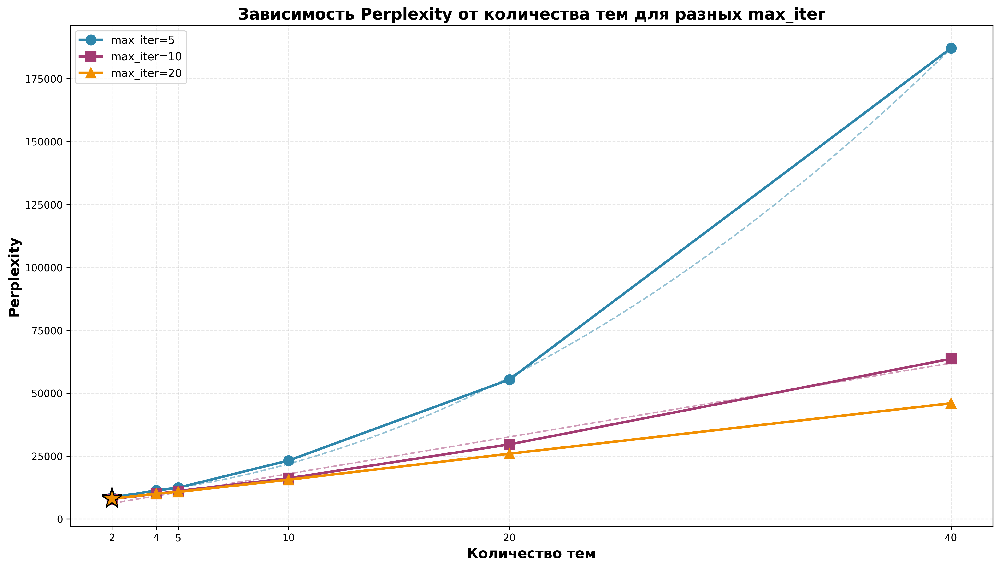
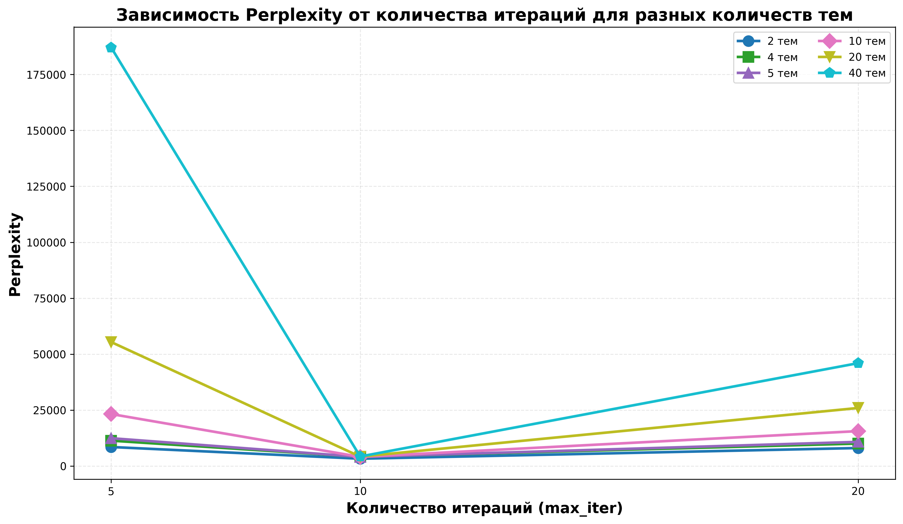
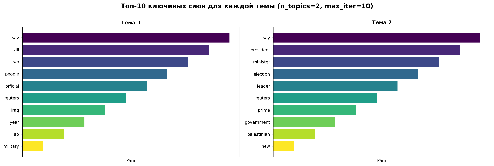

# Лабораторная работа №3.2 (Тематическое моделирование)

## Описание

В рамках лабораторной работы реализовано тематическое моделирование документов с использованием метода LDA (Latent Dirichlet Allocation).

## Структура проекта

```
lab3-2/
├── source/
│   ├── __init__.py
│   ├── main.py                    # Основной скрипт для экспериментов
│   ├── analyze_results.py        # Скрипт для анализа результатов и построения графиков
│   ├── corpus_loader.py           # Загрузка корпуса
│   ├── term_document_matrix.py    # Построение матрицы термин-документ
│   └── utils.py                   # Утилиты для обработки текста
├── assets/                        # Результаты экспериментов
│   ├── results_*topics*.json      # Результаты экспериментов
│   ├── doc_topic_probs_*.tsv      # Вероятности документов
│   ├── perplexity_*.png           # Графики perplexity
│   ├── top_words_frequency.png    # График частоты слов
│   ├── word_diversity.png         # График разнообразия слов
│   ├── topics_visualization_*.png # Визуализации тем
│   └── analysis_report.txt        # Текстовый отчет анализа
├── requirements.txt
└── README.md
```

## Установка зависимостей

```bash
pip install -r requirements.txt
```

## Использование

### Базовый запуск

```bash
cd source
python main.py --test_dataset ../../lab2/assets/source-corpus/test.csv
```

### С экспериментами по количеству итераций

```bash
python main.py --test_dataset ../../lab2/assets/source-corpus/test.csv --experiment_iterations
```

### Параметры

- `--train_corpus`: путь к обучающему корпусу (аннотированному, по умолчанию `../../lab2/assets/annotated-corpus/train`)
- `--test_dataset`: путь к тестовому датасету в формате CSV (обязательный)
- `--output`: директория для сохранения результатов (по умолчанию `../assets`)
- `--n_classes`: количество классов в датасете (по умолчанию 4)
- `--max_iter`: количество итераций обучения LDA (по умолчанию 10)
- `--experiment_iterations`: провести эксперименты с разным количеством итераций (max_iter/2, max_iter, max_iter*2)

## Результаты

Для каждого эксперимента сохраняются:

1. **Результаты эксперимента** в едином JSON файле (`results_{n_topics}topics_iter{max_iter}.json`), содержащем:
   - Топ-10 ключевых слов для каждой темы
   - Perplexity на тестовой выборке
   - Топ-10 документов для каждой темы с вероятностями
2. **Вероятности принадлежности документов** к темам (`doc_topic_probs_{n_topics}topics_iter{max_iter}.tsv`)
3. **График зависимости perplexity от количества тем** с полиномиальной аппроксимацией (`perplexity_plot_iter{max_iter}.png`)
4. **Сводка результатов** (`summary.json`)

### Анализ результатов

Для детального анализа результатов можно использовать скрипт `analyze_results.py`:

```bash
cd source
python analyze_results.py
```

Скрипт автоматически создаст:
- **Графики анализа perplexity** - зависимость perplexity от количества тем с полиномиальной аппроксимацией
- **Графики частоты топ-слов** - топ-20 самых частых слов во всех темах
- **Графики разнообразия слов** - количество уникальных слов в зависимости от количества тем
- **Визуализации тем** - топ-10 ключевых слов для каждого количества тем (2, 4, 5, 10, 20, 40)
- **Текстовый отчет** - подробный анализ результатов в файле `analysis_report.txt`

Все графики сохраняются в директории `assets/` и отображаются в разделе "Визуализации" ниже.

## Эксперименты

Проводятся эксперименты со следующими количествами тем:
- 2, 5, 10, 20, 40
- Количество тем, равное количеству классов в датасете (4)

Для каждого количества тем вычисляется perplexity на тестовой выборке, извлекаются топ-10 ключевых слов для каждой темы, и сохраняются вероятности принадлежности документов обучающей выборки к темам.

## Анализ результатов

### Результаты экспериментов

Проведены эксперименты с количеством тем: 2, 4, 5, 10, 20, 40 и количеством итераций: 5, 10, 20.

#### Оптимальная конфигурация

**Общий оптимум**: `max_iter=20`, `n_topics=2`, `perplexity=8027.26`

#### Perplexity по количеству тем (max_iter=20)

| Количество тем | Perplexity |
|---------------|------------|
| 2             | 8,027.26   |
| 4             | 10,018.15  |
| 5             | 10,771.98  |
| 10            | 15,587.42  |
| 20            | 25,929.62  |
| 40            | 45,970.58  |

#### Влияние количества итераций

Увеличение количества итераций улучшает качество модели (снижает perplexity):

| Количество тем | max_iter=5 | max_iter=10 | max_iter=20 |
|---------------|------------|-------------|-------------|
| 2             | 8,485.44   | 8,192.49    | **8,027.26** |
| 4             | 11,324.54  | 10,314.26   | 10,018.15   |
| 10            | 23,221.08  | 17,259.04   | 15,587.42   |
| 40            | 187,059.66 | 65,674.86   | 45,970.58   |

**Вывод**: 
- Оптимальное количество тем: **2 темы** (для всех значений max_iter)
- Оптимальное количество итераций: **20** (наилучшая perplexity: 8,027.26)
- Perplexity снижается с увеличением количества итераций для всех количеств тем

#### Примеры тем для оптимальной конфигурации (max_iter=20, n_topics=2)

**Тема 1**: say, 39, new, reuters, company, gt, lt, year, inc, report  
**Тема 2**: 39, say, ap, game, two, year, first, win, quot, new

Темы отражают основные категории новостей:
- **Тема 1**: Новости и репортажи (reuters, report, company, year)
- **Тема 2**: Спорт и события (game, win, first, ap)

### Выводы

1. **Оптимальная конфигурация**: `max_iter=20`, `n_topics=2` дает наилучшую perplexity (8,027.26)

2. **Влияние количества итераций**: Увеличение количества итераций с 5 до 20 значительно улучшает качество модели:
   - Для 2 тем: perplexity снижается с 8,485 до 8,027 (улучшение на 5.4%)
   - Для 40 тем: perplexity снижается с 187,060 до 45,971 (улучшение на 75.4%)

3. **Влияние количества тем**: Perplexity растет с увеличением количества тем для всех значений max_iter, что указывает на переобучение при большом количестве тем

4. **Рекомендации**:
   - Использовать 2 темы для данного датасета
   - Использовать 20 итераций для оптимального качества
   - Для больших количеств тем (10+) требуется больше итераций для сходимости

### Визуализации

#### Сравнение Perplexity для разных max_iter

График показывает зависимость perplexity от количества тем для разных значений max_iter (5, 10, 20).



#### Зависимость Perplexity от количества итераций

График показывает, как perplexity изменяется с увеличением количества итераций для разных количеств тем.



#### Визуализация тем (оптимальная конфигурация: max_iter=10, n_topics=2)



