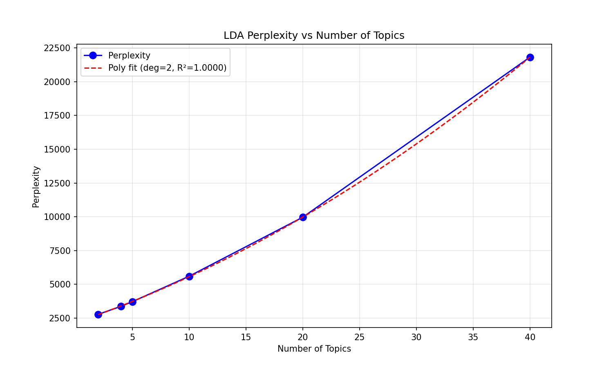

# Лабораторная работа №3.2: Тематическое моделирование

## Описание задания

Кластеризация текстовых документов по темам с использованием модели LDA (Latent Dirichlet Allocation).

## Использованные технологии

- **Модель**: LDA (sklearn.decomposition.LatentDirichletAllocation)
- **Библиотеки**: scikit-learn, numpy, matplotlib
- **Данные**: аннотированный корпус из лабораторной №1
- **Выборка**: train=10000, test=2000
- **Предобработка**: удаление английских стоп-слов, min_df=5, max_df=0.8

## Результаты

### Perplexity в зависимости от количества тем

| topics | perplexity |
|--------|------------|
| 2 | 2784.02 |
| 4 | 3372.58 |
| 5 | 3717.14 |
| 10 | 5602.54 |
| 20 | 9969.95 |
| 40 | 21818.88 |

**Полиномиальная аппроксимация**: степень 2, R² = 1.00

### Топ-10 слов для каждой темы (4 темы — соответствует 4 классам датасета)

| Topic | Top-10 Keywords | Интерпретация |
|-------|-----------------|---------------|
| 0 | company, say, new, reuters, corp, million, software, service | **Бизнес/Технологии** |
| 1 | oil, new, price, say, reuters, year, high, week, rise | **Экономика/Рынки** |
| 2 | say, president, official, reuters, kill, iraq, government, minister | **Политика/Мир** |
| 3 | game, win, team, new, year, season, night, sunday, lead | **Спорт** |

### Топ-10 слов (10 тем — более детальное разделение)

| Topic | Keywords | Интерпретация |
|-------|----------|---------------|
| 0 | software, microsoft, service, new, internet | IT/Software |
| 1 | quot, say, court, year, charge | Право/Суды |
| 2 | president, election, say, leader, minister | Политика |
| 3 | win, world, champion, cup, final | Спорт (чемпионаты) |
| 4 | price, oil, reuters, high, rise | Нефть/Сырьё |
| 5 | game, night, team, new, season | Спорт (лиги) |
| 6 | say, state, european, official, union | Евросоюз |
| 7 | new, year, day, test, make | Общее |
| 8 | say, kill, iraq, people, iraqi | Ирак/Война |
| 9 | say, reuters, company, million, new | Бизнес |

### График Perplexity



## Выводы

1. **Perplexity растёт с числом тем**: зависимость близка к квадратичной. Минимум достигается при 2 темах, но это слишком грубое деление.

2. **4 темы соответствуют структуре датасета**: модель выделяет осмысленные кластеры — Бизнес/Tech, Экономика, Политика, Спорт. Это совпадает с 4 классами исходного датасета.

3. **10 тем дают детализацию**: появляются подтемы — отдельно IT, нефть, Ирак, Евросоюз, чемпионаты vs регулярный сезон.

4. **Рекомендуемое количество тем**: 4-10 в зависимости от требуемой детализации.

## Выходные файлы

- `output/results.txt` — полные результаты экспериментов
- `output/doc_topics_2.tsv` — вероятности принадлежности документов к темам (TSV формат)
- `output/perplexity_plot.png` — график зависимости perplexity от числа тем

## Инструкция по запуску

```bash
cd projects/be-poloshkov/lab3.2/source
python main.py
```
