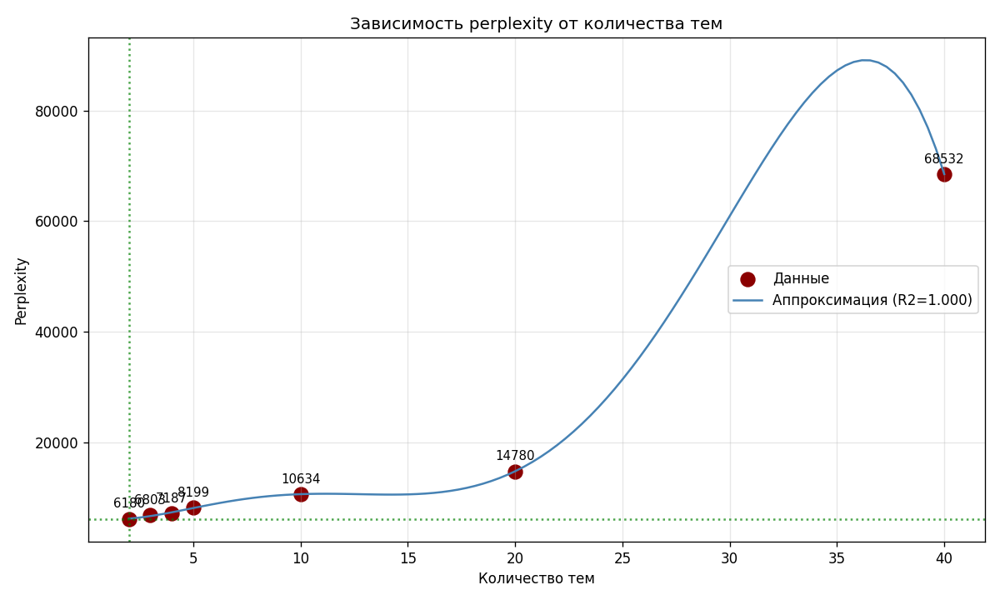

## Отчет по 3 лабораторной

Строится матрица термин-документ с помощью CountVectorizer на тренировочных данных, полученных в 1 лабораторной. На тестовых данных также строится матрица с помощью уже обученного векторизатора.

Производятся эксперименты с LDA с 2, 3, 4, 5, 10, 20, 40 темами. Для каждой модели вычисляется perplexity, и сохраняются в файл вероятности принадлежности документа к каждой из N тем.

Результаты экспериментов:

```
Эксперимент с 2 темами
Perplexity на тестовой выборке: 6180.19
Топ-10 ключевых слов для каждой темы:

Тема #1:
said, year, game, quot, new, president, reuters, sunday, state, season

Тема #2:
new, said, reuters, company, year, corp, million, stock, oil, price
Эксперимент с 3 темами
Perplexity на тестовой выборке: 6803.10
Топ-10 ключевых слов для каждой темы:

Тема #1:
said, year, game, sunday, new, season, team, night, reuters, saturday

Тема #2:
said, reuters, new, company, year, stock, oil, price, york, million

Тема #3:
new, quot, service, company, microsoft, software, internet, computer, year, technology
Эксперимент с 4 темами
Perplexity на тестовой выборке: 7186.50
Топ-10 ключевых слов для каждой темы:

Тема #1:
team, quot, world, year, final, second, time, won, cup, champion

Тема #2:
new, company, said, reuters, year, corp, stock, oil, million, price

Тема #3:
game, new, fullquote, season, reuters, night, york, ticker, http, year

Тема #4:
said, president, reuters, official, iraq, minister, state, people, government, quot
Эксперимент с 5 темами
Perplexity на тестовой выборке: 8199.46
Топ-10 ключевых слов для каждой темы:

Тема #1:
team, second, game, year, season, time, world, point, coach, final

Тема #2:
company, new, said, corp, million, service, year, software, microsoft, business

Тема #3:
reuters, new, fullquote, york, game, target, ticker, http, www, run

Тема #4:
said, iraq, iraqi, police, court, people, city, baghdad, british, yesterday

Тема #5:
said, quot, reuters, president, oil, government, price, new, state, official
Эксперимент с 10 темами
Perplexity на тестовой выборке: 10634.20
Топ-10 ключевых слов для каждой темы:

Тема #1:
drug, press, house, french, say, canadian, claim, step, hurricane, scientist

Тема #2:
company, million, said, service, plan, online, phone, deal, court, music

Тема #3:
european, british, union, open, sun, action, linux, trial, year, gas

Тема #4:
world, team, coach, final, second, cup, champion, point, win, victory

Тема #5:
quot, president, bush, john, election, search, google, presidential, public, say

Тема #6:
said, official, people, reuters, killed, palestinian, friday, security, state, police

Тема #7:
reuters, said, new, stock, price, percent, year, york, oil, fullquote

Тема #8:
new, software, microsoft, computer, technology, company, internet, service, web, security

Тема #9:
game, season, new, year, night, league, run, york, red, series

Тема #10:
minister, said, iraq, prime, country, iraqi, government, india, leader, reuters
Эксперимент с 20 темами
Perplexity на тестовой выборке: 14779.64
Топ-10 ключевых слов для каждой темы:

Тема #1:
company, chief, according, executive, federal, rival, corp, said, report, chip

Тема #2:
plan, palestinian, union, said, program, bank, israeli, million, security, worker

Тема #3:
space, life, scientist, houston, weekend, test, like, look, body, texas

Тема #4:
monday, afp, wireless, hour, sun, nasa, flight, gas, amid, china

Тема #5:
iraq, search, web, loss, iraqi, baghdad, google, site, conference, force

Тема #6:
yesterday, washington, face, court, group, general, department, southern, authority, post

Тема #7:
reuters, fullquote, target, com, ticker, http, www, href, stock, investor

Тема #8:
new, company, service, software, microsoft, internet, computer, technology, news, business

Тема #9:
government, country, minister, said, prime, talk, reuters, nation, north, japan

Тема #10:
game, season, team, year, player, coach, world, time, final, sport

Тема #11:
open, night, victory, lead, win, point, cup, south, league, game

Тема #12:
today, network, research, phone, mobile, nearly, quote, used, late, profile

Тема #13:
president, election, european, bush, john, leader, presidential, november, party, air

Тема #14:
new, york, said, reuters, oil, price, percent, year, quarter, sale

Тема #15:
home, held, digital, friday, florida, action, david, hurricane, insurance, far

Тема #16:
right, india, national, run, return, day, minute, ended, popular, man

Тема #17:
said, people, security, international, official, killed, reuters, police, thursday, start

Тема #18:
year, online, san, cut, ago, australia, america, francisco, job, free

Тема #19:
quot, city, number, led, office, tuesday, british, say, said, came

Тема #20:
state, united, bid, car, term, university, year, club, earlier, bank
Эксперимент с 40 темами
Perplexity на тестовой выборке: 68532.28
Топ-10 ключевых слов для каждой темы:

Тема #1:
software, open, new, test, ibm, company, version, hope, field, server

Тема #2:
news, search, new, service, online, music, company, google, internet, agreement

Тема #3:
nov, roger, ally, struggle, milan, craig, library, steel, joe, musharraf

Тема #4:
technology, help, internet, way, computer, wireless, security, using, need, case

Тема #5:
quot, president, bush, web, general, john, site, november, said, saying

Тема #6:
said, state, minister, united, prime, reuters, international, palestinian, official, south

Тема #7:
second, quarter, game, loss, night, england, half, left, yard, touchdown

Тема #8:
home, took, woman, florida, hurricane, family, mark, injury, body, guard

Тема #9:
say, long, drug, london, french, net, food, health, paris, study

Тема #10:
group, offer, deal, british, service, pay, led, communication, customer, law

Тема #11:
china, run, san, giant, rival, report, maker, reported, game, francisco

Тема #12:
world, today, largest, based, japan, chip, used, year, want, sun

Тема #13:
year, ago, program, leading, new, including, change, signed, britain, human

Тема #14:
company, million, said, billion, agreed, job, corp, cut, street, group

Тема #15:
iraq, city, iraqi, baghdad, force, government, held, nearly, said, militant

Тема #16:
space, head, agency, nasa, scientist, question, jet, water, mission, satellite

Тема #17:
suicide, pilot, join, admitted, spyware, newly, territory, friendly, assist, arthritis

Тема #18:
federal, industry, business, product, bid, company, face, firm, oracle, software

Тема #19:
research, year, contract, quote, past, europe, profile, army, germany, said

Тема #20:
year, old, car, week, power, expected, term, school, club, problem

Тема #21:
war, russia, radio, aimed, looking, tony, television, italian, producer, bring

Тема #22:
reuters, fullquote, com, european, target, stock, ticker, http, set, www

Тема #23:
monday, microsoft, make, ahead, key, october, window, file, called, hold

Тема #24:
new, york, red, hit, bank, big, line, boston, sox, game

Тема #25:
point, final, lead, cup, series, saturday, win, season, sunday, victory

Тема #26:
yesterday, league, yankee, tax, stadium, holiday, hard, atlanta, sept, louis

Тема #27:
tuesday, security, play, number, football, early, high, star, fan, little

Тема #28:
strong, staff, moved, discus, hat, box, writer, cover, philip, mining

Тема #29:
season, right, end, houston, bowl, known, philadelphia, brown, chelsea, indiana

Тема #30:
december, manchester, heart, generation, focus, saddam, irish, hussein, matter, cancer

Тема #31:
people, just, official, said, police, killed, attack, party, life, bomb

Тема #32:
despite, store, minute, forward, spam, shopping, striker, spanish, mart, wal

Тема #33:
month, election, afp, digital, association, director, presidential, far, german, afghanistan

Тема #34:
phone, mobile, free, northern, california, area, cell, winter, aid, risk

Тема #35:
team, coach, world, champion, american, game, australia, state, won, match

Тема #36:
india, result, man, good, look, return, canadian, operation, political, press

Тема #37:
network, sport, start, manager, financial, washington, board, action, baseball, real

Тема #38:
oil, price, percent, reuters, new, sale, year, stock, profit, share

Тема #39:
nation, chief, executive, region, talk, soldier, taking, david, government, african

Тема #40:
according, plan, court, airline, america, trade, union, sell, sign, cost

```

После этого строится полиномиальная аппроксимация графика изменения perplexity в зависимости от количества тем.



Оптимальное количество тем по perplexity - 2.
