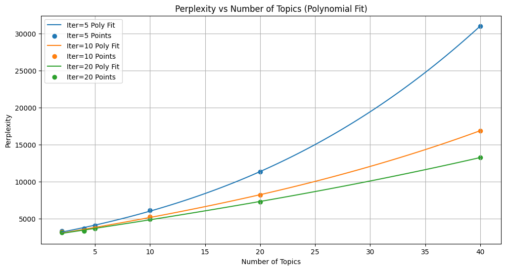
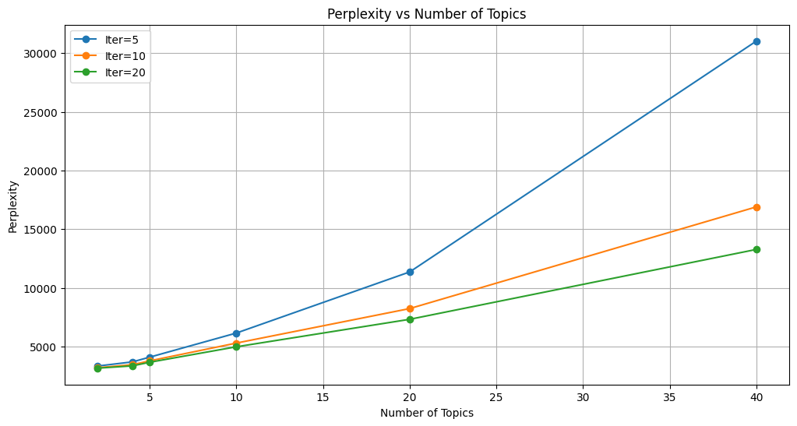

# Лабораторная работа №3.2: Тематическое моделирование

## Описание
Тематическое моделирование текстов с использованием LDA на датасете [AG News](https://huggingface.co/datasets/ag_news).

## Выполненные задачи

### 1. Эксперименты с LDA
Проведены эксперименты с различным количеством тем (2, 4, 5, 10, 20, 40) и итераций (5, 10, 20).

**Примеры топ-10 слов по темам (iter=20, topics=5):**
- **Topic 0:** google, company, new, service, microsoft, internet, software, inc, com, system
- **Topic 1:** said, reuters, iraq, najaf, afp, president, two, rebel, official, iraqi
- **Topic 2:** new, said, quot, reuters, bank, say, plan, space, may, state
- **Topic 3:** athens, olympic, gold, game, win, medal, first, team, olympics, woman
- **Topic 4:** reuters, price, oil, stock, new, said, inc, profit, investor, sale

### 2. Анализ Perplexity

**Зависимость Perplexity от количества тем:**

| Topics | Iter=5 | Iter=10 | Iter=20 |
|--------|--------|---------|---------|
| 2      | 3337.50| 3195.45 | 3156.72 |
| 4      | 3690.03| 3446.73 | 3350.26 |
| 5      | 4094.19| 3779.35 | 3659.76 |
| 10     | 6149.10| 5294.29 | 4977.29 |
| 20     | 11356.78| 8234.27| 7319.10 |
| 40     | 31028.79| 16900.74| 13273.88|

### 3. Выводы

**Оптимальное количество тем:** 4-5 тем
- Минимальный Perplexity при балансе интерпретируемости
- При 2 темах — слишком грубое разделение
- При 10+ темах — резкий рост Perplexity

**Оптимальное количество итераций:** 20
- Стабильное снижение Perplexity с увеличением итераций
- Дальнейшее увеличение дает минимальный выигрыш

## Результаты

