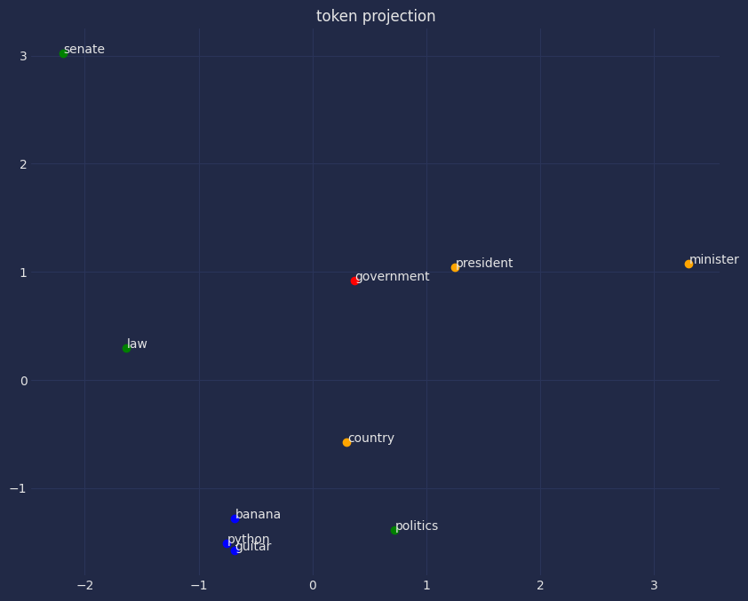

# Лабораторная работа №2 (Векторизация текстов)

## Описание

В этой лабораторной работе реализуется задача векторизации текстов с использованием модели Word2Vec. Работа направлена на создание векторных представлений слов и документов, которые могут быть использованы в последующих задачах обработки естественного языка.

## Используемые данные

Для экспериментов используются:
- Тексты из .csv файлов (train.csv и test.csv)
- Размеченные корпуса текстов из директории `annotated-corpus`, содержащей обучающие и тестовые данные, разделенные по классам

## Модели и методы

### Основная модель:
- Word2Vec - модель для получения векторных представлений слов

### Методы векторизации:
- Усреднение векторов слов - усреднение векторов всех слов в документе
- Взвешивание по TF-IDF - взвешивание векторов слов по их важности в документе

### Метрики оценки:
- Косинусное расстояние между векторами слов
- Сравнение близости похожих слов, слов из одной области и несвязанных слов

## Эксперименты

### 1. Обучение Word2Vec модели
- Вектор размерностью 200
- Окно контекста 5
- Минимальная частота слова 2
- Skip-gram модель (sg=1)
- 8 эпох обучения

### 2. Токенизация текстов
Реализована сложная токенизация, включающая:
- Обработка специальных токенов (email, телефон, валюты, URL и др.)
- Замена специальных паттернов на заглушки
- Разделение текста на предложения
- Приведение к нижнему регистру

### 3. Оценка качества векторных представлений
Анализ косинусных расстояний между:
- Похожими словами
- Слова из той же области
- Несвязанными словами

### 4. Гиперпараметрическая оптимизация
Сравнение моделей с разными параметрами:
- Вектор размерностью 100 и 200
- Разные конфигурации параметров

### 5. Создание векторных представлений документов
- Усредненные векторы документов (embeddings_avg.tsv)
- Векторы с использованием TF-IDF весов (embeddings_tfidf.tsv)

## Результаты

### Основные выводы:
- Модель Word2Vec успешно обучена на корпусе текстов
- Косинусные расстояния показывают логичную семантическую близость слов
- Похожие слова имеют меньшие расстояния, чем несвязанные слова
- TF-IDF взвешивание улучшает качество представлений для некоторых задач

### Примеры косинусных расстояний:
- government и administration: 0.5676
- market и economy: 0.5077
- team и club: 0.5632
- technology и software: 0.5227

## Визуализации

- PCA визуализация выбранных токенов в 2D пространстве

## Заключение

Работа демонстрирует успешное применение модели Word2Vec для создания векторных представлений слов и документов. Полученные векторные представления показывают логичную семантическую структуру, где близкие по смыслу слова находятся близко в векторном пространстве. Результаты экспериментов подтверждают, что модель способна захватывать лингвистические и семантические отношения между словами. Полученные файлы embeddings_avg.tsv и embeddings_tfidf.tsv могут быть использованы в последующих задачах классификации текстов и других NLP задачах.