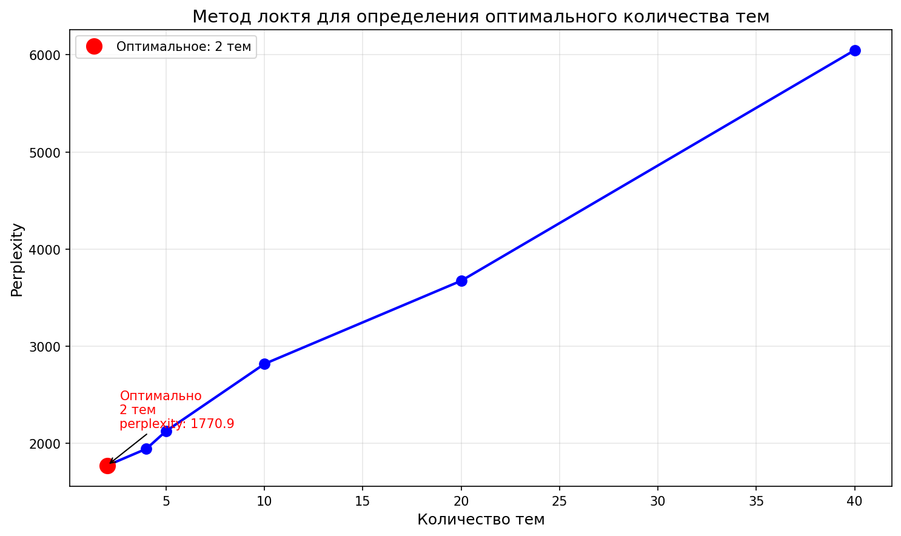

# Лабораторная работа №3.2: Тематическое моделирование

## Описание задания
В данной лабораторной работе проводится тематическое моделирование на наборе текстовых данных (AG News) с использованием алгоритма Latent Dirichlet Allocation (LDA). Цели работы:

- Подготовка текстовых данных (токенизация, удаление стоп-слов, лемматизация)
- Построение term-document матрицы с помощью `CountVectorizer`
- Обучение нескольких моделей LDA с разным количеством тем (2, 4, 5, 10, 20, 40)
- Анализ полученных тем через топ-ключевые слова
- Оценка качества моделей с помощью метрики perplexity на тестовой выборке
- Сохранение вероятностей принадлежности документов к темам
- Полиномиальная аппроксимация результатов
- Определение оптимального количества тем
- Проведение экспериментов с различным количеством итераций

## Использованные технологии и инструменты
- **Датасет**: AG News (тексты новостей, 4 категории)
- **Модель**: LatentDirichletAllocation из библиотеки scikit-learn
- **Библиотеки**:
  - numpy, pandas
  - scikit-learn (для LDA, векторизации, метрик)
  - nltk (для предобработки текста)
  - matplotlib, seaborn (для визуализации)
  - scipy, tqdm, json, pickle, os, warnings
- **Инструменты**: Jupyter Notebook

## Результаты работы
### 1. Подготовка данных
Тексты были очищены от стоп-слов, цифр и специальных символов, приведены к нижнему регистру.

### 2. Term-document матрица
Создана матрица размером:
- Обучающая: (120000, 3000)
- Тестовая: (7600, 3000)

### 3. Обучение моделей LDA
Обучены модели с количеством тем: 2, 4, 5, 10, 20, 40.

### 4. Топ-ключевые слова для каждой модели
Для каждой модели извлечены топ-10 слов по темам. Например:
```
============================================================
Модель LDA с 2 темами:
============================================================

Тема #1:
  new, said, reuters, company, million, corp, oil, year, york, percent

Тема #2:
  said, new, president, reuters, sunday, game, world, yesterday, saturday, night
```

### 5. Оценка perplexity
| Количество тем | Perplexity |
|----------------|------------|
| 2              | 1770.88    |
| 4              | 1943.63    |
| 5              | 2126.13    |
| 10             | 2817.56    |
| 20             | 3673.71    |
| 40             | 6048.33    |

Чем меньше perplexity, тем лучше модель описывает данные. Наилучший результат показала модель с 2 темами.

### 6. Сохранение результатов
- Вероятности принадлежности документов к темам сохранены в формате `.tsv`
- Топ-5 документов для каждой темы сохранены в `.json`

### 7. Полиномиальная аппроксимация и визуализация perplexity


### 8. Оптимальное количество тем


### 9. Проведение экспериментов с различным количеством итераций
```
Результаты экспериментов с количеством итераций:
------------------------------------------------------------

Количество итераций: 5
  Фактическое количество итераций до сходимости: 5
  Perplexity на обучении: 1512.29
  Perplexity на тесте: 1785.04
  Разница (тест - обучение): 272.75

Количество итераций: 10
  Фактическое количество итераций до сходимости: 10
  Perplexity на обучении: 1500.95
  Perplexity на тесте: 1770.88
  Разница (тест - обучение): 269.94

Количество итераций: 20
  Фактическое количество итераций до сходимости: 20
  Perplexity на обучении: 1497.12
  Perplexity на тесте: 1766.33
  Разница (тест - обучение): 269.21
```

## Выводы
1. Модель с меньшим количеством тем (2) показала наилучшую perplexity, что может указывать на то, что данные хорошо группируются в две крупные тематические группы.
2. Увеличение количества тем приводит к росту perplexity, что может свидетельствовать о переобучении или излишней детализации.
3. Тематическое моделирование с LDA позволяет выявить скрытые темы в новостных текстах, что может быть полезно для автоматической категоризации и анализа контента.
4. Модель с 4 темами (по количеству классов в AG News) не показала наилучшего результата, что может говорить о том, что новостные тексты содержат более сложную тематическую структуру.

## Инструкция по запуску

### 1. Установка зависимостей
```bash
pip install -r requirements.txt
```

### 2. Загрузка датасета
Убедитесь, что файлы с данными (train.csv, test.csv) находятся в директории с ноутбуком или укажите путь к ним в коде.

### 3. Запуск ноутбука
Последовательность выполнения:
1. Выполните ячейки импорта библиотек.
2. Загрузите и предобработайте данные.
3. Постройте term-document матрицу.
4. Обучите модели LDA.
5. Проанализируйте результаты (топ-слова, perplexity).
6. Сохраните вероятности и топ-документы.
7. Выполните полиномиальную аппроксимацию
8. Определите оптимальное количество тем
9. Проведите эксперименты с различным количеством итераций
