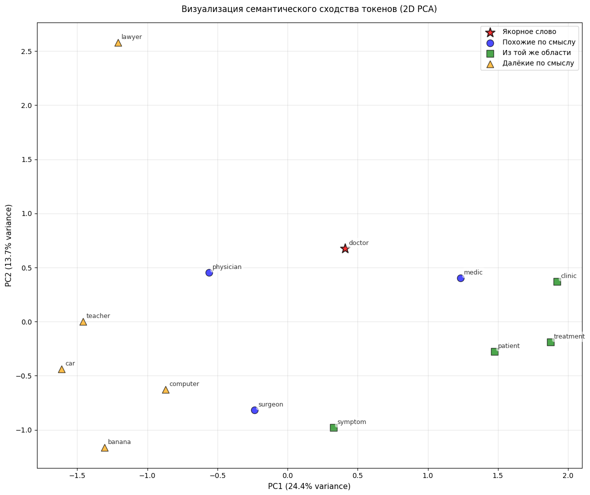

# Лабораторная работа №2 — Векторизация текста (базовый уровень)

## 1. Цель

Получить векторные представления текстов на основе нейросетевой модели **Word2Vec**, обученной на обучающем корпусе.
Векторизация выполняется **на тех же токенах**, что были подготовлены в ЛР-1 (аннотированный корпус `annotated-corpus` в формате `.tsv`).

## 2. Данные

Используется структура:

```
assets/
  annotated-corpus/
    train/
      1/  *.tsv
      2/  *.tsv
      3/  *.tsv
      4/  *.tsv
    test/
      1/  *.tsv
      2/  *.tsv
      3/  *.tsv
      4/  *.tsv
```

* Папки `1..4` — это темы/классы (label).
* Каждый документ — отдельный `.tsv` файл.
* Внутри `.tsv` — по одной строке на токен, **3 колонки** (пример):

```
Seven      seven      seven
Georgian   georgian   georgian
soldiers   soldier    soldier
...
```

Колонки интерпретируются так:

* `col=0` — исходная форма (surface)
* `col=1` — лемма (lemma)
* `col=2` — нормализованная/другая форма (normalized)

**В работе выбирается один столбец как “токен”** (по умолчанию `col=1`, леммы).

## 3. Реализация

В ноутбуке последовательно выполняются шаги:

1. Загрузка документов из `assets/annotated-corpus/train` и `assets/annotated-corpus/test`
2. Обучение `Word2Vec` на обучающих документах
3. Демонстрация семантической близости через косинусное расстояние
4. Векторизация тестовой выборки
5. Сохранение результата в `test_embeddings_w2v.tsv`

## 4. Реализация “токенизатора” из ЛР-1 (TSV-парсер)

### 4.1. Чтение токенов из одного документа

* **Токенизатор** в данном контексте — это функция, которая не “режет строку regex’ом”,
  а **читает уже размеченные токены из `.tsv`**, полученные в ЛР-1.

Параметры:

* `col` — какой столбец использовать как токен (0/1/2)
* `drop_punct` — удалять ли токены без букв/цифр (опционально)

### 4.2. Формирование документов

Каждый `.tsv` превращается в список токенов:

```python
["reuters", "short", "sellers", "wall", "street", ...]
```

Такой формат напрямую подходит для обучения Word2Vec.

## 5. Модель Word2Vec

Модель обучается на `train_docs`:

* `vector_size = 100` — размерность эмбеддинга
* `window = 5` — контекстное окно
* `min_count = 3` — фильтр редких слов
* `sg = 1` — Skip-gram
* `epochs = 10` — число эпох

Результат: каждому токену соответствует вектор из 100 чисел.

## 6. Косинусное расстояние

Для проверки семантической близости вычисляется косинусное расстояние.
Ожидается, что:

* для семантически близких слов расстояние меньше,
* для далёких — больше.

## 7. Вектор документа

Вектор документа строится как **среднее** по эмбеддингам токенов документа:

1. берём все токены документа
2. для токенов, которые есть в словаре Word2Vec, получаем векторы
3. усредняем по координатам

Если в документе нет ни одного токена из словаря — возвращаем нулевой вектор.

## 8. Формат выходного файла

Файл `test_embeddings_w2v.tsv` сохраняется в формате:

```
<doc_id>    <e1>    <e2>    ...    <e100>
```

* `doc_id` — имя исходного `.tsv` файла без расширения (например `000032`)
* дальше 100 вещественных чисел — компоненты эмбеддинга документа
* разделитель — TAB (`\t`)
* заголовка нет


## 9. Визуализация

<pre>
    anchor="doctor",
    similar_words=["physician", "surgeon", "medic"],
    same_domain_words=["patient", "clinic", "treatment", "symptom"],
    different_words=["car", "computer", "lawyer", "teacher", "banana"],
</pre>
<br>
