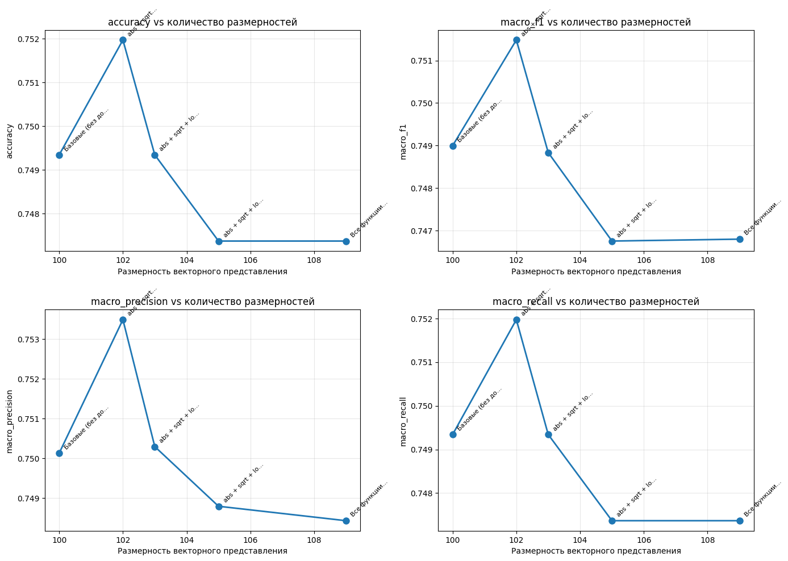
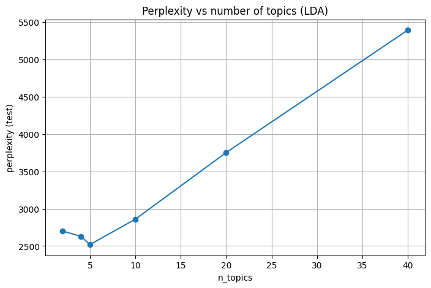

# Лабораторная работа №3

## 3.1. Классификация текстов

### Цель работы

Исследовать методы классификации текстовых документов на основе векторных представлений слов, сравнить различные настройки SVM-классификатора, а также проанализировать влияние размерности признакового пространства на качество классификации.


### Предобработка и векторизация

* Из файлов `.tsv` извлекаются токены (первый столбец).
* Документы приводятся к строковому виду.
* Используется **CountVectorizer**:

  * `max_features = 5000`
  * `min_df = 2`
* Получается матрица «документ–термин» для train и test.

---

### Обучение классификатора

Используется **Support Vector Machine (SVM)** со следующими параметрами:

* Ядра: `linear`, `rbf`
* Число итераций: [100, 500, 750, 1000, 1500, 2000, 5000]

Оценка качества проводится на тестовой выборке.


### Метрики качества

Для каждой конфигурации вычисляются:

* `accuracy`
* `error_rate`
* `micro_f1`
* `macro_f1`
* `macro_precision`
* `macro_recall`

---


### Анализ влияния размерности признаков

#### 1. Случайное уменьшение размерности

Из исходного пространства признаков случайно выбирается подмножество признаков размерности:

```
[100, 80, 60, 40, 20]
```

Для каждой размерности обучается SVM с лучшими найденными гиперпараметрами.


**Вывод:**
При уменьшении размерности качество классификации снижается, однако при размерностях около 60–80 сохраняется приемлемый баланс между точностью и вычислительной сложностью.

---

#### 2. PCA (Principal Component Analysis)

Вместо случайного отбора признаков применяется **PCA**:

* PCA обучается **только на обучающей выборке**
* Test-данные трансформируются тем же преобразованием
* Используется связка `StandardScaler + PCA`

Анализ проводится для:

```
[100, 90, 80, 70, 60, 50, 40, 30, 20, 10] компонент
```

Дополнительно фиксируется доля сохранённой дисперсии (`explained_variance_ratio`).


**Вывод:** PCA обеспечивает более стабильное качество при сильном снижении размерности в сравнении со случайным выбором.

---

#### 3. Ручное добавление математических признаков

Для лучшей модели: kernel=rbf, max_iter=1000 добавили 

```
=== Базовые (без доп. признаков) ===
Размерность: 100

=== abs + sqrt ===
Размерность: 102

=== abs + sqrt + log ===
Размерность: 103

=== abs + sqrt + log + cos + sin ===
Размерность: 105

=== Все функции ===
Размерность: 109
```


## 3.2. Тематическое моделирование

### Цель работы

Исследовать методы тематического моделирования текстов, построить модели LDA с различным количеством тем и определить оптимальное число тем на основе метрики perplexity.

---

### Используемая модель

Применяется **Latent Dirichlet Allocation (LDA)** из `sklearn`.

LDA — это вероятностная модель, которая:

* представляет документ как смесь тем,
* представляет тему как распределение по словам.

---

### Векторизация для LDA

Используется CountVectorizer с усиленной фильтрацией:

* `max_features = 5000`
* `min_df = 5`
* `stop_words = "english"`
* `token_pattern = r"\b[a-zA-Z]{3,}\b"`

Это позволяет убрать шумовые слова и улучшить интерпретируемость тем.

---

### Эксперименты

Модели LDA обучаются для следующих значений числа тем:

```
k = [2, 4, 5, 10, 20, 40]
```

(значение `k=4` соответствует числу классов в датасете)

Для каждой модели фиксируется:

* значение **perplexity** на тестовой выборке,
* топ-10 слов для каждой темы,
* вероятности принадлежности документов к темам (`P(doc | topic)`),
* документы с максимальной вероятностью для каждой темы.

Результаты вероятностей сохраняются в файл:

```
lda_topic_probs_train.npz
```

---

### Perplexity

**Perplexity** — метрика качества вероятностной модели:

* чем **меньше perplexity**, тем лучше модель объясняет данные;
* используется для сравнения моделей с разным числом тем.

---

### График: Perplexity vs число тем

Строится график зависимости perplexity от числа тем.

**Наблюдение:**

* Минимальное значение perplexity достигается при `k ≈ 5`.
* При увеличении числа тем perplexity возрастает, что указывает на переобучение.



---

### Полиномиальная аппроксимация и R²

Для графика perplexity применяется полиномиальная аппроксимация степеней 1–7.

* Лучшая аппроксимация достигается при степени **5** (`R² ≈ 1.0`)

**Важно:** аппроксимация используется только для анализа формы кривой, а не для выбора параметров модели.


---

### Анализ числа итераций

Дополнительно исследуется влияние параметра `max_iter`:

```
max_iter = [10, 20, 40]
```

**Вывод:**

* Увеличение числа итераций улучшает стабильность perplexity,
* После определённого значения улучшения становятся незначительными,
* Оптимальным является среднее значение `max_iter`.

### Топ слов по кол-ву тем

```
=== TOP-10 слова для k=2 ===
Тема 1: said, new, reuters, company, quot, president, microsoft, year, million, iraq
Тема 2: reuters, new, oil, game, stocks, prices, world, york, said, year

=== TOP-10 слова для k=4 ===
Тема 1: said, new, company, million, reuters, corp, year, billion, business, com
Тема 2: new, game, season, win, team, night, world, oil, victory, year
Тема 3: new, quot, microsoft, space, search, said, software, security, world, web
Тема 4: reuters, said, iraq, stocks, president, oil, minister, fullquote, afp, government

=== TOP-10 слова для k=5 ===
Тема 1: company, million, said, new, internet, com, deal, business, billion, online
Тема 2: game, season, new, win, team, night, world, victory, year, league
Тема 3: new, microsoft, quot, space, search, software, said, security, windows, computer
Тема 4: said, iraq, reuters, president, minister, afp, people, killed, government, officials
Тема 5: reuters, oil, said, new, stocks, prices, percent, fullquote, york, year

=== TOP-10 слова для k=10 ===
Тема 1: com, music, million, company, online, oracle, apple, peoplesoft, bid, billion
Тема 2: oil, prices, reuters, new, stocks, dollar, record, economy, growth, economic
Тема 3: space, said, european, nuclear, quot, union, iran, nasa, new, air
Тема 4: said, china, reuters, india, afp, president, russia, united, talks, japan
Тема 5: reuters, fullquote, sales, said, quarter, profit, percent, target, stocks, http
Тема 6: said, new, mobile, company, wireless, phone, intel, corp, plans, ibm
Тема 7: game, season, win, team, night, new, world, victory, league, cup
Тема 8: microsoft, software, new, security, court, windows, internet, search, web, linux
Тема 9: new, quot, years, press, canadian, scientists, like, just, study, year
Тема 10: iraq, said, bush, president, reuters, killed, police, iraqi, election, baghdad

=== TOP-10 слова для k=20 ===
Тема 1: online, internet, service, music, wireless, com, million, new, services, phone
Тема 2: british, london, quot, new, manager, said, england, club, britain, airport
Тема 3: space, european, quot, nuclear, iran, said, nasa, union, talks, agency
Тема 4: china, india, said, reuters, afp, russia, president, peace, darfur, government
Тема 5: sales, quarter, percent, year, said, growth, profit, report, economy, chief
Тема 6: korea, north, hurricane, south, said, power, florida, tax, state, yukos
Тема 7: red, game, new, sox, season, team, year, league, night, series
Тема 8: microsoft, software, new, security, windows, linux, source, sun, ibm, internet
Тема 9: quot, new, like, years, just, scientists, time, say, old, life
Тема 10: bush, president, said, police, killed, election, reuters, israeli, people, gaza
Тема 11: united, cup, world, canadian, states, court, press, lead, drug, canada
Тема 12: said, billion, company, corp, million, oracle, buy, deal, peoplesoft, bid
Тема 13: reuters, fullquote, com, target, stocks, ticker, http, www, investor, href
Тема 14: new, mobile, intel, phone, technology, sony, computer, chip, phones, digital
Тема 15: oil, prices, reuters, record, dollar, new, crude, high, barrel, euro
Тема 16: game, win, season, victory, night, team, coach, points, sunday, saturday
Тема 17: iraq, iraqi, apple, said, baghdad, french, arafat, troops, hostage, forces
Тема 18: google, search, stocks, new, stock, investors, street, wall, shares, web
Тема 19: open, cut, jobs, air, workers, holiday, cuts, airways, strike, stores
Тема 20: federal, gold, olympic, athens, said, million, pay, judge, medal, bank

=== TOP-10 слова для k=40 ===
Тема 1: strong, prize, credit, travel, confidence, private, consumer, card, sales, october
Тема 2: coach, england, team, football, new, head, manager, job, david, notre
Тема 3: space, nasa, launch, new, dvd, sony, station, turkey, mission, european
Тема 4: talks, peace, darfur, sudan, russia, region, said, reuters, russian, president
Тема 5: quarter, profit, year, percent, sales, said, earnings, loss, reported, growth
Тема 6: intel, north, korea, nuclear, health, south, power, chip, said, korean
Тема 7: year, sox, red, season, yankees, grand, new, game, team, night
Тема 8: microsoft, software, windows, new, source, linux, sun, open, ibm, server
Тема 9: players, league, united, los, arsenal, angeles, star, manchester, old, club
Тема 10: bush, president, election, gaza, israeli, presidential, kerry, john, vote, israel
Тема 11: states, united, face, study, drug, scientists, font, size, new, washington
Тема 12: japan, afp, ibm, japanese, tokyo, amd, said, computer, business, personal
Тема 13: reuters, global, change, asia, countries, leaders, said, economic, world, asian
Тема 14: series, red, new, game, sox, boston, like, york, world, just
Тема 15: points, night, victory, win, scored, game, real, state, lead, goal
Тема 16: game, season, sunday, nfl, yards, field, win, bowl, quarterback, victory
Тема 17: apple, music, iran, french, nuclear, france, ipod, germany, german, european
Тема 18: chief, executive, trial, ceo, president, chairman, company, disney, fraud, officer
Тема 19: cut, research, jobs, profile, quote, cuts, airways, said, holiday, bankruptcy
Тема 20: olympic, gold, athens, women, medal, reserve, olympics, games, federal, men
Тема 21: killed, people, said, baghdad, police, iraq, city, bomb, car, attack
Тема 22: security, internet, computer, mail, users, new, online, spam, software, service
Тема 23: report, according, economy, year, released, growth, percent, market, august, rate
Тема 24: trade, air, airlines, united, said, boeing, force, airport, taiwan, flight
Тема 25: bank, pay, million, said, industry, fund, new, group, company, exchange
Тема 26: oil, prices, reuters, crude, record, high, new, price, barrel, fuel
Тема 27: reuters, fullquote, com, target, ticker, http, www, investor, href, stocks
Тема 28: dollar, euro, tour, champions, cup, world, european, tokyo, reuters, coast
Тема 29: quot, world, said, great, says, mark, died, yesterday, son, story
Тема 30: china, australia, test, williams, india, new, chinese, australian, day, beijing
Тема 31: million, billion, buy, company, said, deal, corp, group, sell, stake
Тема 32: bid, oracle, peoplesoft, offer, tax, board, takeover, billion, yukos, rival
Тема 33: mobile, wireless, phone, new, service, video, internet, phones, services, communications
Тема 34: search, google, web, com, new, online, yahoo, site, internet, engine
Тема 35: court, arafat, palestinian, leader, yasser, ruling, death, law, rights, house
Тема 36: stocks, shares, new, reuters, york, street, wall, stock, investors, higher
Тема 37: iraq, british, minister, said, prime, hostage, blair, iraqi, troops, release
Тема 38: cup, open, round, san, final, world, francisco, lead, win, second
Тема 39: press, canadian, india, hurricane, pakistan, florida, canada, ivan, indian, new
Тема 40: security, police, iraq, arrested, said, army, war, najaf, military, council
```