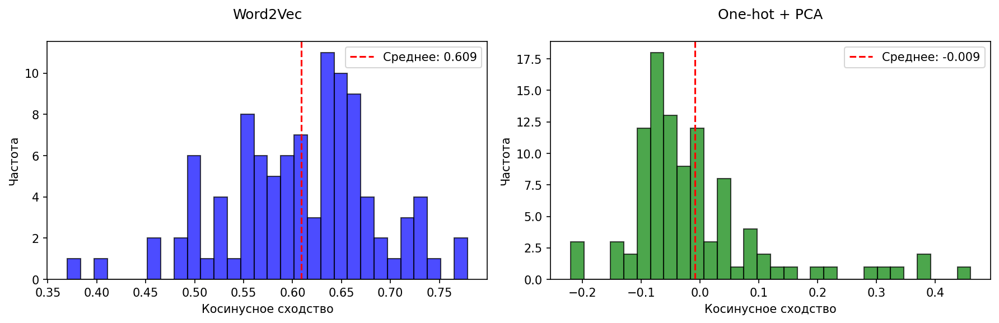

# Lab 2: Text Vectorization

Векторизация текста с использованием Word2Vec и базовых методов.

## Файлы

- `lab2.ipynb` - основной ноутбук с реализацией
- `word2vec.model` - обученная модель Word2Vec
- `term_frequencies.json` - частоты токенов
- `term_index.json` - индекс токенов
- `term_document_matrix.npz` - разреженная матрица термин-документ
- `vectors_onehot_pca.npy` - векторы после PCA
- `test_embeddings.tsv` - итоговые эмбеддинги тестовой выборки

## Что реализовано

- Построение словаря токенов и term-document матрицы
- One-hot encoding с PCA
- Обучение Word2Vec модели
- Демонстрация косинусного расстояния между токенами
- Векторизация документов через усреднение эмбеддингов токенов
- Сохранение результатов в TSV

## Визуализации

### Term-Document Matrix Heatmap

### Сравнение методов векторизации

## Запуск

Открыть `lab2.ipynb` и выполнить все ячейки.
