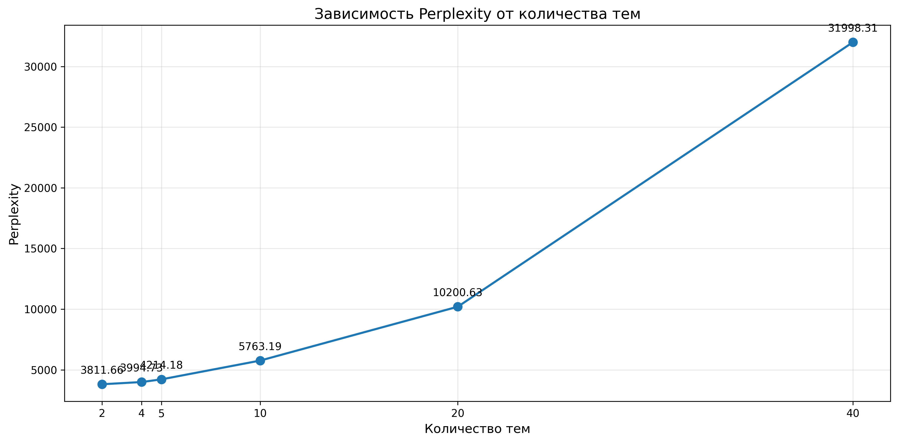
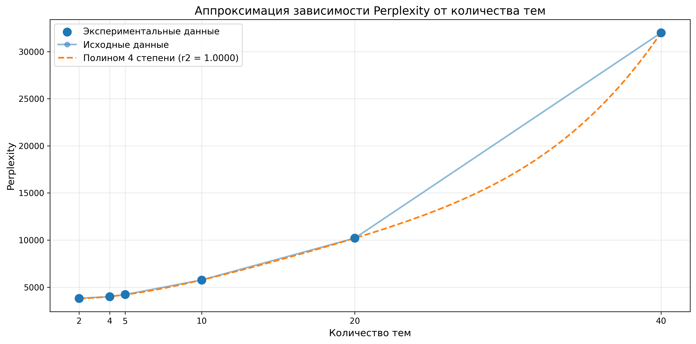
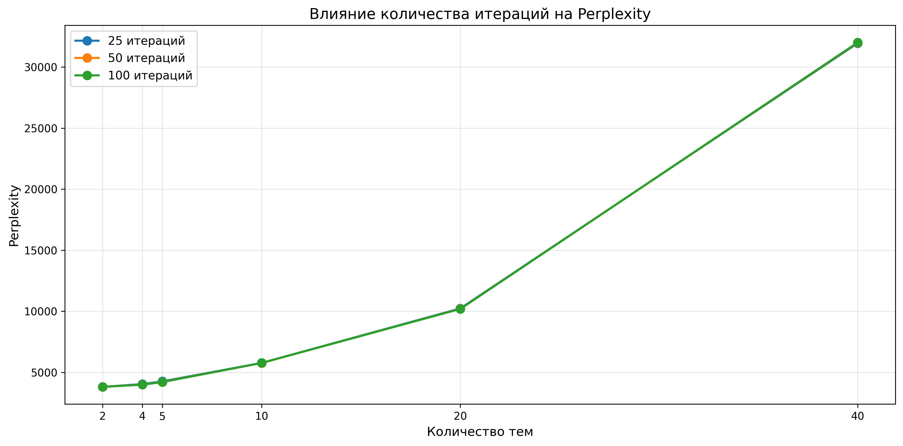

# Lab 3.2 - Тематическое моделирование

LDA на матрице из lab2. Обучение с разным количеством тем (2, 5, 10, 20, 40).

## Perplexity vs Количество тем



## Полиномиальная аппроксимация



## Влияние итераций



## Результаты

```
Количество тем:  2 | Perplexity: 3811.6596
Количество тем:  4 | Perplexity: 3994.7344
Количество тем:  5 | Perplexity: 4214.1769
Количество тем: 10 | Perplexity: 5763.1913
Количество тем: 20 | Perplexity: 10200.6350
Количество тем: 40 | Perplexity: 31998.3084
```
оптимально 2 темы для данного датасета. Несмотря на 4 исходных класса, LDA разделил документы на 2 более широкие темы: финансово-экономическую и общую новостную. Это может означать, что некоторые классы похжи лексически

Лучший результат:

```
оптимальное кол-во тем: 2
Perplexity: 3811.6596
лучшая аппроксимация: Полином 4 степени с r2 = 1.0000

топ 10 слов для оптимальной модели (2 тем):
  Тема 1: oil, price, 39, reuters, new, u, say, stock, U.S., high
  Тема 2: 39, say, reuters, gt, lt, Inc., company, fullquote, stock, n
```

Тема 1: экономика/финансы
Тема 2: общие новостные термины

Оптимальное количество итераций:

```
25 итераций: средний perplexity = 10011.0970
50 итераций: средний perplexity = 9997.1176
100 итераций: средний perplexity = 9996.1478

Оптимальное количество итераций: 100
```

