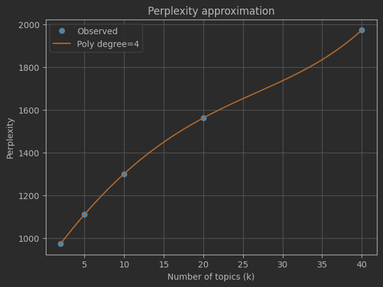

# Лабораторная работа №3.2 
**Тематическое моделирование текстов с использованием LDA**

## Описание задания

В рамках лабораторной работы реализовано тематическое моделирование текстового корпуса с использованием алгоритма **Latent Dirichlet Allocation (LDA)**.  
Основная цель работы — построение модели, выделяющей скрытые темы в наборе документов, а также анализ влияния числа тем и количества итераций обучения на качество модели.

В ходе работы:
- использовался корпус текстов, размеченный по классам (pos / neg);
- дополнены методы предыдущих лабораторных для фильтрации стоп-слов;
- реализовано построение матрицы «документ–терм» (TDM);
- проведены эксперименты с различным числом тем и итераций обучения;
- качество модели оценивалось с помощью метрики perplexity.

---

## Использованные технологии и инструменты

- **Датасет**:  
  Текстовый корпус отзывов в формате:
```

train/
├── pos/*.tsv
└── neg/*.tsv

```
Каждый документ состоит из набора аннотированных предложений.

- **Модели**:
- Сложные регулярные выражения для формирования токенов
- CountVectorizer — для построения словаря и text-document-matrix
- Latent Dirichlet Allocation (LDA) — для тематического моделирования

---

## Результаты работы

### Эксперименты с числом тем и количеством итераций

Были проведены эксперименты для следующих значений:
- число тем: **k ∈ {2, 10, 20}**
- количество итераций: **max_iter ∈ {5, 10, 20}**

Метрика качества — **perplexity** (чем ниже, тем лучше).

#### Значения perplexity

| k  | max_iter | Perplexity |
|----|----------|------------|
| 2  | 5        | 5141.34    |
| 2  | 10       | 5138.93    |
| 2  | 20       | 5133.01    |
| 10 | 5        | 9267.71    |
| 10 | 10       | 8727.31    |
| 10 | 20       | 8279.22    |
| 20 | 5        | 16135.02   |
| 20 | 10       | 13709.98   |
| 20 | 20       | 12147.88   |



---

### Примеры полученных тем

Для малых значений `k` (например, `k=2`) темы получаются обобщёнными и содержат в основном высокочастотные слова:

```

Тема 0: story, life, time, character, love, great, make, best, year, good
Тема 1: good, really, time, bad, character, make, movie, scene, story, think

```

При увеличении числа тем (`k=10`, `k=20`) появляются более специализированные темы, содержащие:
- имена персонажей,
- названия фильмов,
- специфическую лексику отдельных поджанров.

Пример темы при `k=20`:
```

Тема 0: star, war, luke, new, character, story, time, game, davy, battle

````

---

## Выводы

1. **Увеличение числа итераций обучения** приводит к стабильному снижению perplexity для всех значений `k`.
2. **Меньшее число тем (k=2)** даёт минимальное значение perplexity, но темы при этом слишком обобщённые и слабо интерпретируемые.
3. **Большие значения k (10, 20)** позволяют получить более интерпретируемые и содержательные темы, но увеличивают perplexity.
4. Наблюдается классический компромисс между:
   - численной метрикой качества (perplexity),
   - интерпретируемостью тем.
5. Использование CountVectorizer позволяет отфильтровать токены по частоте встречи в документе и построить TDM.